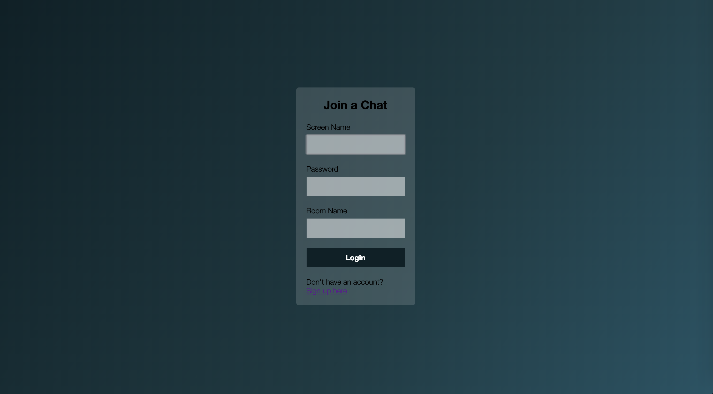
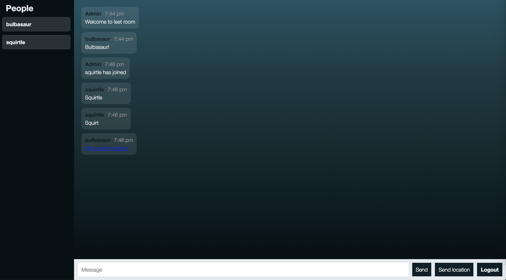

# Shadow Gab

A real-time chat web application utilizing web sockets.

## Goal

This is a fun project I decided to expand on in order to challenge myself to learn a new technology. Being that my focus was to implement and understand web sockets better, there are some pieces missing from this project that I plan to add over time.

## How to run

You can take this application for a test drive by running the `npm start` script from this project's directory in the terminal.

## Features

- Rooms (via web sockets)
- Location services
- Auto-scrolling
- Authentication & Password Encryption

## Technologies and Frameworks

**Built with**
- Socket.io
- Express
- MongoDB
- Mongoose

## Tests

Tests can be run by using the `npm test` command from the terminal.

## Screenshots

